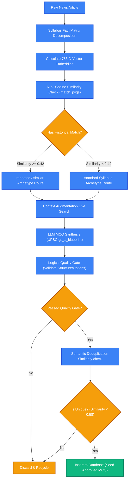

# AI Synthesis & Question Generation Loop

This document details the **AI Synthesis, Quality Gate, and Generation Gating Workflow** in **Khabar100 2.0**. It outlines how raw national news is transformed into high-rigor, academically accurate UPSC-grade questions using custom LLM feedback loops, historical question anchoring, and strict quality evaluations.

---

## 1. Question Generation Pipeline Flow

---

## 2. In-Depth Operational Core Steps

### Stage 1: The Dimension Decomposition Matrix
Using raw text scraped from whitelisted national outlets, `gemini-2.5-flash-lite` decomposes current affairs into a structured "Dimension Matrix."
- It extracts precise, syllabus-aligned dynamic facts (e.g., specific bills, environmental treaty amendments, science discoveries).
- It scores the relevance of each fact from `1` to `10` based on historical UPSC exam patterns. Any fact scoring `< 6` is immediately discarded.

### Stage 2: Historical Question Anchoring (Vector Search)
We do not let the AI generate questions out of thin air. Instead, the pipeline anchors the synthesis process using real questions asked in the civil services exam over the past 16 years.
- The pipeline calculates a vector embedding of the fact context using Gemini's `text-embedding-004` (768 dimensions).
- It queries the `pyqs` table inside Supabase using the cosine similarity function `match_pyqs` (threshold `0.42`).
- If a match is found, the historical question's text and year are injected into the generator's system context. The model is instructed to study the logical traps, options structure, and style of that specific historical question when formulating the new MCQ.

### Stage 3: Real-Time Context Augmentation Search
To prevent model hallucination (such as generating outdated statutory metrics or guessing a newly proposed bill's parent ministry), the generator triggers a live search through Serper / Tavily API. The top 3 Google News snippets are injected into the prompt as the **Ground-Truth Reference Context**, forcing the model to align with present-day facts.

### Stage 4: Logical Quality Gate Gating
Once an MCQ is synthesized, it is passed to a secondary, independent LLM execution context acting as an aggressive UPSC Quality Auditor.
The auditor evaluates the MCQ against a strict set of structural rules:
1. **No Soft Options**: Rejects questions containing trivial options or predictable distractors.
2. **UPSC Option Compliance**: Rejects any multi-statement question that does not use modern UPSC formats (*'Only one', 'Only two', 'All three', 'None'*).
3. **Reasoning Integrity**: Rejects questions where the specified correct option doesn't align with the detailed explanation.
4. **No Placeholders**: Instantly filters out incomplete text or placeholder links.

If the question fails any of these audits, it is discarded, and the pipeline recycles to the next dimension fact candidate.

---

## 3. High-Quality Prompting Design

By structuring the AI's operations into isolated specialized tasks—**Fact Decomposition -> Vector Anchoring -> Live Search Augmentation -> MCQ Synthesis -> Logical Auditing**—Khabar100 2.0 achieves extremely high academic rigor and zero hallucination, completely superseding standard single-shot prompt architectures.
