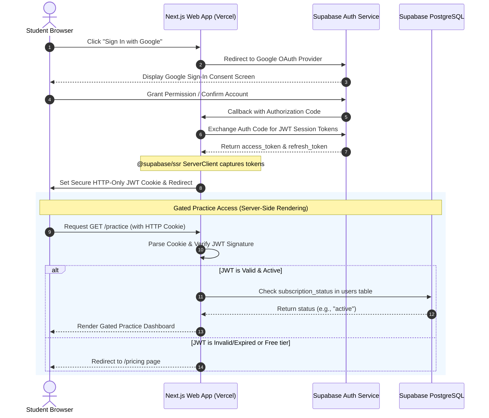

# Authentication & Server-Side Cookie Synchronization

This document explains the architecture of **Khabar100 2.0**'s hybrid client-server authentication. It outlines how the application utilizes **Supabase Auth** for secure Google OAuth sign-in and couples it with `@supabase/ssr` to synchronize client authorization states with secure, server-side HTTP-only cookies.

---

## 1. Authentication Flow Diagram

The dynamic sync between the client browser, Vercel Serverless Edge, and Supabase auth services ensures secure, instant authorization.



---

## 2. Server-Side Cookie Sync Strategy

### A. Why Client-Only Session Tokens Fail in SaaS
In standard Single Page Applications (SPAs), authentication states are typically stored in client-side LocalStorage. However, this model suffers from several design bottlenecks:
1. **Flash of Unauthenticated Content (FOUC)**: The browser renders the landing page or dashboard before JavaScript loads, runs, reads LocalStorage, and redirects the user, creating a jarring UX.
2. **SEO Penalization**: Search engine bots cannot execute complex client-side auth sweeps, failing to index protected, search-friendly educational outlines.
3. **Weak Gating**: Client-side gating is easily bypassed by blocking JavaScript or spoofing DOM configurations.

### B. The SSR Solution: Cookie Sync Gating
To resolve these bottlenecks, Khabar100 2.0 implements **@supabase/ssr** cookie syncing:
- **Client Client Initialization** (`src/lib/supabase/client.ts`): Uses `createBrowserClient` to trigger client-side authentication events (e.g., sign-in, password resets).
- **Server Client Initialization** (`src/lib/supabase/server.ts`): Uses `createServerClient` inside Next.js Server Components, API Routes, and Middleware.
- **Middleware Sync Interceptor** (`src/middleware.ts`): Intercepts *every* single HTTP page request. It reads the JWT from request cookies, refreshes the token with Supabase Auth if it is close to expiry, and writes the updated cookies back to the response headers before the page is rendered.

---

## 3. Implementation Code References

### `src/lib/supabase/server.ts` (Example Server-Side Cookie Configuration)
```typescript
import { createServerClient } from "@supabase/ssr";
import { cookies } from "next/headers";

export async function createClient() {
  const cookieStore = await cookies();

  return createServerClient(
    process.env.NEXT_PUBLIC_SUPABASE_URL!,
    process.env.NEXT_PUBLIC_SUPABASE_ANON_KEY!,
    {
      cookies: {
        getAll() {
          return cookieStore.getAll();
        },
        setAll(cookiesToSet) {
          try {
            cookiesToSet.forEach(({ name, value, options }) =>
              cookieStore.set(name, value, options)
            );
          } catch {
            // The `setAll` method was called from a Server Component.
            // This can be ignored if you have middleware refreshing
            // user sessions in the background.
          }
        },
      },
    }
  );
}
```

This elegant design guarantees that every server-rendered page receives authenticated session details on the very first network packet, offering bulletproof route security and stunningly fast page load speeds.
