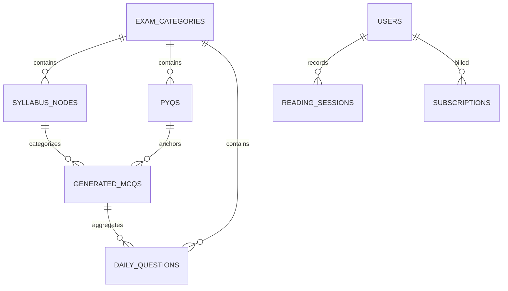

# Database Schema, Indexes & Row-Level Security

This document details the relational database schema of **Khabar100 2.0** on Supabase/PostgreSQL. It highlights how the platform utilizes custom types, vector embeddings, performance indexes, and strict Row-Level Security (RLS) policies to operate a highly secure, high-performance SaaS.

---

## 1. Database Entity Relationships Diagram

The database structure is designed to represent syllabus nodes, historical exams, subscription states, and daily practicing sessions cleanly.



---

## 2. Core Operational Tables

### A. `users`
Represents student accounts, tracking names, emails, and active subscription parameters.
```sql
CREATE TABLE users (
    id UUID PRIMARY KEY REFERENCES auth.users(id) ON DELETE CASCADE,
    email TEXT UNIQUE NOT NULL,
    full_name TEXT,
    subscription_status TEXT DEFAULT 'free' CHECK (subscription_status IN ('free', 'active', 'cancelled')),
    subscription_expiry TIMESTAMPTZ,
    created_at TIMESTAMPTZ DEFAULT NOW(),
    updated_at TIMESTAMPTZ DEFAULT NOW()
);
```

### B. `exam_categories`
Stores the target competitive exam profiles (e.g., UPSC Prelims).
```sql
CREATE TABLE exam_categories (
    id UUID PRIMARY KEY DEFAULT gen_random_uuid(),
    name TEXT NOT NULL,
    slug TEXT UNIQUE NOT NULL,
    description TEXT,
    created_at TIMESTAMPTZ DEFAULT NOW()
);
```

### C. `syllabus_nodes`
Stores the hierarchical syllabus trees mapping subjects to core topics and indices.
```sql
CREATE TABLE syllabus_nodes (
    id UUID PRIMARY KEY DEFAULT gen_random_uuid(),
    exam_category_id UUID REFERENCES exam_categories(id) ON DELETE CASCADE,
    subject TEXT NOT NULL,
    topic TEXT NOT NULL,
    sub_topic TEXT,
    weightage NUMERIC(5,2) DEFAULT 0.0,
    created_at TIMESTAMPTZ DEFAULT NOW()
);
```

### D. `pyqs` (Past Year Questions)
Contains actual historical questions asked in competitive exams, with 768-dimensional vector embeddings for cosine similarity lookups.
```sql
CREATE TABLE pyqs (
    id UUID PRIMARY KEY DEFAULT gen_random_uuid(),
    exam_category_id UUID REFERENCES exam_categories(id) ON DELETE CASCADE,
    question_text TEXT NOT NULL,
    options JSONB NOT NULL,
    correct_option CHAR(1) NOT NULL,
    explanation TEXT,
    year INTEGER NOT NULL,
    embedding VECTOR(768), -- Lowers vector dimensions to support text-embedding-004
    created_at TIMESTAMPTZ DEFAULT NOW()
);
```

### E. `generated_mcqs`
The primary table populated by the Daily Ingestion Pipeline. Stores synthesized questions, option parameters, content hashes, and vector embeddings.
```sql
CREATE TABLE generated_mcqs (
    id UUID PRIMARY KEY DEFAULT gen_random_uuid(),
    exam_category_id UUID REFERENCES exam_categories(id) ON DELETE CASCADE,
    syllabus_node_id UUID REFERENCES syllabus_nodes(id) ON DELETE SET NULL,
    question TEXT NOT NULL,
    options JSONB NOT NULL,
    correct_option CHAR(1) NOT NULL,
    explanation TEXT NOT NULL,
    reasoning_type TEXT NOT NULL CHECK (reasoning_type IN ('repeated', 'similar', 'syllabus')),
    matched_pyq_id UUID REFERENCES pyqs(id) ON DELETE SET NULL,
    matched_pyq_year INTEGER,
    subject_tag TEXT,
    source_article_url TEXT,
    review_status TEXT DEFAULT 'pending' CHECK (review_status IN ('pending', 'approved', 'rejected')),
    content_hash VARCHAR(64) UNIQUE NOT NULL, -- SHA-256 unique deduplication hash
    embedding VECTOR(768), -- For real-time post-gen semantic deduplication checks
    created_at TIMESTAMPTZ DEFAULT NOW()
);
```

---

## 3. Database Indexes for High-Performance Queries

To ensure rapid queries as data sizes grow, several indexing strategies are applied:

1. **Unique Deduplication Index**:
   ```sql
   CREATE UNIQUE INDEX idx_mcq_content_hash ON generated_mcqs(content_hash);
   ```
2. **Relational Join Indexes**:
   ```sql
   CREATE INDEX idx_mcq_category ON generated_mcqs(exam_category_id);
   CREATE INDEX idx_syllabus_category ON syllabus_nodes(exam_category_id);
   ```
3. **pgvector Similarity Search Indexes (HNSW)**:
   For rapid cosine similarity searches on vector columns:
   ```sql
   CREATE INDEX idx_pyq_embedding_hnsw ON pyqs USING hnsw (embedding vector_cosine_ops);
   CREATE INDEX idx_mcq_embedding_hnsw ON generated_mcqs USING hnsw (embedding vector_cosine_ops);
   ```

---

## 4. Custom PL/pgSQL Similarity Matching Functions

### `match_pyqs` (Cosine Similarity Matching on Past Year Questions)
```sql
CREATE OR REPLACE FUNCTION match_pyqs(
    query_embedding VECTOR(768),
    match_threshold FLOAT,
    match_count INT,
    category_id UUID
)
RETURNS TABLE (
    id UUID,
    question_text TEXT,
    year INT,
    similarity FLOAT
)
LANGUAGE plpgsql
AS $$
BEGIN
    RETURN QUERY
    SELECT
        p.id,
        p.question_text,
        p.year,
        1 - (p.embedding <=> query_embedding) AS similarity -- Cosine similarity math
    FROM pyqs p
    WHERE p.exam_category_id = category_id
      AND 1 - (p.embedding <=> query_embedding) > match_threshold
    ORDER BY p.embedding <=> query_embedding ASC
    LIMIT match_count;
END;
$$;
```

---

## 5. Row-Level Security (RLS) Policies

To protect the platform's proprietary question bank from scraper harvesting while providing seamless, cookie-sync gated public access, strict Row-Level Security (RLS) is enforced:

### A. RLS Enforcements
```sql
ALTER TABLE exam_categories ENABLE ROW LEVEL SECURITY;
ALTER TABLE syllabus_nodes ENABLE ROW LEVEL SECURITY;
ALTER TABLE pyqs ENABLE ROW LEVEL SECURITY;
ALTER TABLE generated_mcqs ENABLE ROW LEVEL SECURITY;
```

### B. Access Rules
- `exam_categories` is set to **Public Read**, allowing anyone to view available category cards on the landing page:
  ```sql
  CREATE POLICY "Allow public select on categories" 
  ON exam_categories FOR SELECT USING (true);
  ```
- `syllabus_nodes`, `pyqs`, and `generated_mcqs` are **Strictly Gated**. Client-side public read access is explicitly blocked. Instead, client sessions are verified server-side through cookie-synced Next.js Server Components initialized with the elevated `SUPABASE_SERVICE_ROLE_KEY` after verifying the user's active subscription status.
