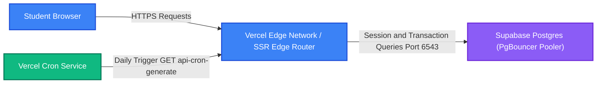

# Deployment Guide (Vercel & Supabase)

This document provides guidelines for deploying **Khabar100 2.0** to production environments, focusing on hosting the Next.js application on **Vercel**, database pooling on **Supabase**, and automating the scheduled daily news processing via **Vercel Crons**.

---

## 1. Hosting Architecture Overview

The production hosting model utilizes serverless edge-computing and database pooling to minimize cost while achieving infinite scalability.



---

## 2. Supabase Production Deployment

### A. Database Provisioning
- Spin up a new PostgreSQL database instance on Supabase.
- Enable the following extensions in the Supabase SQL Editor:
  - `uuid-ossp` (for standard ID calculations)
  - `vector` (pgvector for similarity searches)

### B. Connection Pooling (PgBouncer)
Because serverless Next.js functions scale horizontally and can generate hundreds of concurrent, short-lived connections, you must use Supabase's **connection pooling** to prevent database port exhaustion:
- **Direct Connection** (Port 5432): Use this *only* for schema migrations (`supabase db push`) and offline CLI configurations.
- **PgBouncer Pooler** (Port 6543, set `pgbouncer=true`): Use this connection string for your primary `DATABASE_URL` environment variable inside your Vercel Next.js deployment. This ensures connections are multiplexed and transaction-recycled efficiently.

---

## 3. Vercel Frontend Deployment

Deploying the Next.js framework to Vercel is streamlined and fully integrated:

1. Import your Khabar100 GitHub repository into Vercel.
2. Configure the **Build Settings**:
   - Framework Preset: `Next.js`
   - Build Command: `npm run build`
   - Output Directory: `.next`
3. Configure the **Production Environment Variables** in the Vercel Dashboard (see [`.env.example`](../.env.example) for details).
4. Deploy the main branch.

---

## 4. Scheduled Daily UPSC Question Generation (Vercel Crons)

The daily UPSC MCQ generation engine is fully automated using standard serverless Vercel Crons.

### A. Cron Security Gating
To prevent malicious third parties from invoking the compute-intensive question generation endpoints, the endpoint `/api/cron/generate` is gated securely:
1. When configuring Crons in Vercel, Vercel automatically attaches a secure header `Authorization: Bearer <CRON_SECRET>` to the scheduled requests.
2. The router `/api/cron/generate/route.ts` verifies this header value against `process.env.CRON_SECRET` on server execution. If the signatures do not match, it instantly blocks the request with a `401 Unauthorized` status.

### B. Cron Configuration (`vercel.json`)
The daily scheduler is configured using a `vercel.json` file in the root directory:

```json
{
  "crons": [
    {
      "path": "/api/api/cron/generate",
      "schedule": "0 5 * * *"
    }
  ]
}
```

*Note*: The schedule `"0 5 * * *"` triggers the pipeline every day at 05:00 UTC (10:30 AM IST), ensuring fresh UPSC Prelims-grade mock practice questionnaires are aggregated and ready for students before they start their day.
