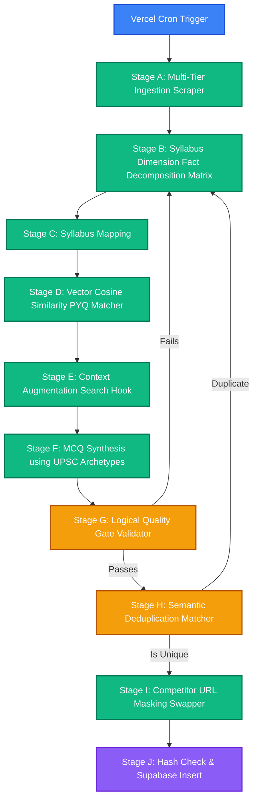

# The Ingestion & News Processing Pipeline

This document explores the core **Ingestion, Augmentation, Synthesis, and Validation Pipeline** of **Khabar100 2.0**. This pipeline is the crown jewel of the platform, automating the curation of Daily Current Affairs questions that challenge students with authentic, UPSC exam-level logical rigor.

---

## 1. High-Level Pipeline Pipeline Flow

The news processing pipeline runs in sequential stages, from raw scraping to final high-fidelity insertion. It is designed to be highly resilient, self-healing, and duplicate-proof.

---

## 2. Exhaustive Step-by-Step Pipeline Specifications

### Stage A: Multi-Tier Ingestion Scraper
The pipeline operates on three distinct scraper tiers to guarantee a daily quota of 100 high-fidelity questions:
- **Tier 1 (Strict Present-Day Ingestion)**: Scrapes official, highly premium national directories (Press Information Bureau (PIB) India, Drishti IAS, AffairsCloud, Legacy IAS, Insights on India, PW OnlyIAS, VisionIAS).
- **Tier 2 (SaaS Aggregator Top-Up Fallback)**: If Tier 1 yield is insufficient, the system falls back to calling paginated SaaS aggregation endpoints (NewsData.io, NewsAPI, EventRegistry) to pool up to 300 Indian politics and science articles.
- **Tier 3 (Broad News Query Top-Up Fallback)**: As a tertiary fallback, the pipeline executes a broad Google News query via Serper.dev for any missing specific subject domains (Economy, Environment, etc.).

### Stage B: Syllabus Dimension Fact Decomposition Matrix
Raw aggregated texts can be noisy, massive, or irrelevant. The pipeline feeds raw text chunks of 100,000 characters into `gemini-2.5-flash-lite` with a specialized "Syllabus Fact Auditor" prompt. This model decomposes the news into an array of up to 120 key UPSC facts, scoring and dropping trivial news (gossip, weather, local crimes).

### Stage C: Syllabus Mapping
Each extracted fact is mapped to a primary UPSC syllabus node ID (`syllabus_nodes` table) by matching the content's thematic parameters (e.g., polity, international treaties) with syllabus classifications. If a fact cannot be cleanly categorized, it is skipped (particularly in Tier 2 to prevent low-yield topics from slipping in).

### Stage D: Vector Cosine Similarity PYQ Matcher
To make generated questions feel like the real exam, the platform matches active facts to real historical questions asked in the UPSC Prelims over the past 16 years.
- The pipeline calculates a 768-dimensional vector embedding of the fact.
- It invokes the Supabase Postgres RPC function `match_pyqs`.
- The database returns the closest matching historical PYQ based on cosine similarity:
  - **Similarity >= 0.55 (`repeated`)**: Marks that the topic has been repeatedly tested. The model is routed to generate a question mirroring the exact historical structure.
  - **Similarity >= 0.42 (`similar`)**: Marks that the topic is similar. The model is routed to use the historical PYQ as a style anchor.
  - **Similarity < 0.42 (`syllabus`)**: Marks that the topic is novel but syllabus-relevant. The model is routed to perform standard syllabus question synthesis.

### Stage E: Context Augmentation Search Hook
If a fact has a conceptual or statutory hook (e.g., references a bill or constitutional article), the pipeline triggers a live web search (Serper / Tavily API) to retrieve exact, present-day facts, preventing the model from hallucinating outdated data.

### Stage F: MCQ Synthesis using UPSC Archetypes
The system compiles the final UPSC-grade question. If the topic is complex, it creates a standard 3-statement UPSC hybrid question (Statement 1: Dynamic Current Event; Statement 2: Static background/Concept; Statement 3: Parent Ministry/Act) with options: *'Only one', 'Only two', 'All three', 'None'*.

### Stage G: Logical Quality Gate Validator
Synthesized MCQs are passed through a "Logical Quality Gate" running on `gemini-2.5-flash-lite`. The model acts as an aggressive auditor, rejecting questions with obvious distractors, factual ambiguity, or incomplete explanations.

### Stage H: Semantic Deduplication Matcher
To prevent students from receiving redundant questions, the new MCQ text is vectorized and compared against all previously generated questions. If the cosine similarity exceeds `0.58`, the question is rejected as a duplicate.

### Stage I: Competitor URL Masking Swapper
To maintain clean, public-safe academic citation sources, any reference URL pointing to competing prep portals is processed through a Google News search to swap the link with an official national publication (e.g., PIB, The Hindu).

### Stage J: Hash Check & Supabase Insert
The server calculates a unique SHA-256 content hash of the validated question and options. If a database collision is detected, the insert is skipped. Otherwise, the question, options, explanation, embedding vector, and syllabus metadata are securely inserted into `generated_mcqs` table, ready for student dashboards.
